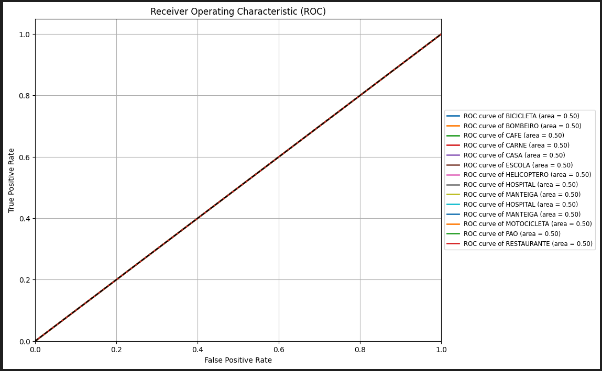

# Processamento e Reconhecimento de Sinais de Libras 

## Sumário
- [Sobre](#Sobre)
- [Motivativação](#Motivação)
- [Objetivos](#Objetivos)
- [Metologia](#Metologia)
    - [Achando uma Base de Dados](#Achando-uma-Base-de-Dados)
    - [Modelos Utilizados](#Modelos-Utilizados)
    - [Pré-Processamento](#Pré-Processamento)
    - [Treinamento dos Modelos](#Treinamento-dos-Modelos)
- [Resultados](#Resultados)
    - [Gráficos](#Gráficos)
    - [Predições](#Predições)
- [Conclusão](#Conclusão)
- [Agradecimentos](#Agradecimentos)
- [Autores](#Autores)
- [Licença](#Licença)
## 🚀 Sobre
O projeto se trata de uma ferramenta de reconhecimento e processamento de sinais da Língua Brasileira de Sinais (Libras) em um ambiente virtual de aprendizado para alunos que gostariam de aprender a reproduzi-los. Assim, o vídeo desenvolvido pelo aluno será enviado para a plataforma e será realizada uma validação se o sinal está de acordo com o banco de dados, dessa forma, entregando ao aluno se a reprodução está de acordo.

## 🎗️ Motivação
A Língua Brasileira de Sinais é reconhecida como um dos pilares da inclusão e da igualdade de direitos para pessoas surdas, garantindo-lhes acesso à educação, informação, cultura e mercado de trabalho. No entanto, ainda existem desafios significativos relacionados à sua difusão e compreensão por parte da população em geral. Nesse contexto, a aplicação de tecnologias de IA, como sistemas de reconhecimento e processamento de sinais de Libras, representa um avanço revolucionário para facilitar a aprendizagem e promover a acessibilidade comunicativa de forma eficiente e escalável. 

Já a motivação deste trabalho surge após a participação do projeto de extensão GAAL (Games de apoio à aprendizagem em Libras). Durante esse projeto, foi experienciado várias dificuldades na criação de Serious Games - jogos que possuem fins educativos como foco principal, além do entretenimento - em que atendam às recomendações dos professores de Libras e tenham um design atraente e divertido para os alunos ouvintes e não-ouvintes, da escola parceira deste projeto.
## 📝 Objetivos
* Estudar como funcionam as técnicas de Deep Learning;
* Estudar diferentes modelos de rede neurais convolucionais;
* Analisar e discutir sobre a acurácia do modelo utilizado para reconhecer o acesso a materiais de educação inclusivos no Brasil.
## 🔬 Metodologia
### Passos
* **Achando uma Base de Dados**  
A base usada para este projeto foi a [V-Librasil](https://libras.cin.ufpe.br/). A base de dados possui por volta de 1350 sinais diferentes feita por 3 articuladores, totalizando em um pouco mais de 4000 vídeos para o treinamento. 

* **Modelos Utilizados**
Baseando-se na literatura vistas, os modelos escolhidos foram:

1. **Inception ResNetV2**
Combina a aequitetura Inception, que utiliza blocos convolucionais com diferentestamanhos de filtros para capturar várias características da imagem, com a arquitetura ResNet, que emprega conexões residuais para facilitar o treinamento de redes profundas. É eficiente para tarefas de classificação de imagens complexas devido à sua capacidade de extrair características detalhadas 

2. **ResNet50V2** 
É uma versão aprimorada do modelo ResNet50, que utiliza conexões residuais para mitigar o problema de degradação em redes muito profundas. A versão V2 ajusta a ordem das operações nos blocos residuais, o que melhora a convergência e o desempenho em tarefas de classificação de imagens.

3. **MobileNetV2**
Focado em eficiência e desempenho em dispositivos móveis, esse modelo utiliza blocos de convolução profundos e separáveis para reduzir o número de parâmetros sem sacrificar a precisão. É ideal para aplicações que requerem modelos leves e rápidos, como a execução em dispositivos com recursos limitados

* **Pré-processamento**
Através do OpenCV, foi possível o processamento dos sinais de
libras, já que essa biblioteca oferece uma série de ferramentas e
algoritmos para operações como detecção de rostos,
reconhecimento de objetos, rastreamento de movimentos,
análise de fluxo óptico.

Foi feito rotulação de todos os videos e criado um diretório para cada sinal distinto. Sinais que possuiam mesmo sinonimo ficaram juntos no mesmo diretório.

**Seleção de quadros**: Foram selecionados, aleatoriamente, 50
quadros de cada vídeo usando uma distribuição normal, que se
mostrou melhor que a uniforme nos experimentos.
Acreditamos que isso se deve ao fato de os vídeos já estarem
pré-processados e centralizados temporalmente.

O **conjunto de dados** selecionado foi o seguinte: 
* **Produtos de Mercado**: Tomate, Carne, Pão, Manteiga e Café.
* **Automóveis**: Motocicleta, Helicóptero, Bicicleta, Trem.
* **Prédios**: Restaurante, Bombeiro, Hospital, Casa e Escola

Todos os videos foram redimensionados para 224x224 para o treinamento do modelo.

**Divisão dos conjuntos de treino, validação e teste**: A divisão
dos conjuntos de treino é de 70%, a validação é de 15% e o
teste é de 15%. As observações de validação e teste foram
exclusivamente do conjunto de dados da UFPE, pois é a única
fonte que possui pelo menos três observações por categoria.
Assim, todas as fontes estavam presentes no conjunto de
treino.

* **Treinamento dos Modelos**

**Máximo de Épocas** =  50 \
**Dropout** = 0.5 \
**Batch Size** = 32 \
**Early Stopping** = 5

|       | **Inception ResNetV2** | **ResNet50V2**     | **MobileNetV2** |
| :---  |    :----:              |    :---:           |        :---:   |
|**Accuracy** | 0.0538 (5%)   | 0.2608 (27%)   |  0.9742 (97%)         |
|**Loss**   |   2.6392       | 2.0398      |       0.0898         |
|**Val Accuracy** | 0.0729 (7%)   | 0.6562 (65%)   |  0.9861 (98%)         |
|**Val Loss**   |   2.6393       | 1.7757      |       0.0654         |
|**Épocas rodadas**|6|20|26|

## 📉 Resultados

A análise dos resultados demonstra que o modelo **MobileNetV2** obteve o melhor desempenho, com uma acurácia de 97% e uma perda de 0,0898 após 26 épocas, confirmando sua capacidade de generalização e eficiência no treinamento. O **Inception ResNetV2**, por outro lado, apresentou um desempenho significativamente inferior, com uma acurácia de apenas 5% e uma perda elevada de 2,6392, indicando que o modelo não conseguiu aprender adequadamente, mesmo após 6 épocas. O **ResNet50V2** alcançou uma acurácia intermediária de 27%, mas a perda ainda foi alta, sugerindo que o modelo necessitaria de ajustes para melhorar seu aprendizado. Com base na comparação dos tempos de processamento, optou-se por utilizar os três modelos de forma combinada. Esta escolha reflete uma estratégia para equilibrar eficiência e robustez no sistema.

### Gráficos
* **ROC Curve**
**MobileNetV2**

**ResNet50V2**

**InceptionResNetV2**

* **Precision and Recall**

**MobileNetV2**

**ResNet50V2**

**InceptionResNetV2**

* **Train vs Validation Accuracy**

**MobileNetV2**

**ResNet50V2**

**InceptionResNetV2**

* **Train vs Validation Loss**

**MobileNetV2**

**ResNet50V2**

**InceptionResNetV2**

### Predições
- Good Examples

- Bad Examples

## 🌟 Conclusão

O desenvolvimento desta ferramenta de reconhecimento e
processamento de sinais da Língua Brasileira de Sinais
(Libras), em um ambiente virtual de aprendizado,
representa um avanço significativo no apoio à educação
de Libras. A ferramenta de inteligência artificial criada
permite que os alunos enviem vídeos de suas práticas de
sinais, os quais são validados em relação a um banco de
dados robusto, oferecendo feedback a respeito da
execução do usuário.

Até o presente momento, é possível observar que existem
altas expectativas para que esse modelo funcione e possua
uma boa acurácia. No relatório de formalização, a ideia
inicial seria que o usuário pudesse reproduzir o sinal ao
vivo, porém, ao serem analisadas as dificuldades por trás
do processo, é notável que o ideal será que o usuário
envie um vídeo para que, esse sim, seja validado.
Enquanto isso, o modelo de reconhecimento de sinais ao
vivo terá que ser trabalhado futuramente.

Além disso, com as novas avaliações, notamos que os
landmarks não serão possíveis, uma vez que o nível de
execução faria com que o projeto demorasse muito mais
para ser concluído. No geral, o abandono do uso de
landmarks e reestruturação do conjunto de dados usado
foram os passos ideais para que o projeto fosse possível,
mas serão mudanças super viáveis para que projetos futuros
sejam realizados.

Portanto, a ferramenta tem demonstrado um progresso
promissor na validação automática de sinais de Libras,
aproximando-se de oferecer resultados úteis e aplicáveis no
contexto educacional.

As melhorias contínuas e a ampliação do banco de dados
serão cruciais para aprimorar a eficácia e a precisão da
plataforma, consolidando-a como uma ferramenta valiosa
para estudantes de Libras. Este projeto contribui
significativamente para a inclusão digital e a acessibilidade
educacional, promovendo o aprendizado autônomo e eficaz
da Língua Brasileira de Sinais.

## Agradecimentos

Gostaríamos de expressar nossa sincera gratidão ao Banco de
Dados do [V-Librasil](https://libras.cin.ufpe.br/), que forneceu recursos essenciais para o
desenvolvimento da pesquisa científica de Libras no Brasil.
Agradecemos também ao Professor Fábio Faria, cuja
orientação e apoio foram fundamentais ao longo deste projeto.
Nosso reconhecimento especial ao monitor Christian, por sua
dedicação e assistência contínua, que contribuíram
significativamente para o sucesso deste trabalho.

## Autores

- [@gssabbado](https://github.com/gssabbado)
- [@gabituzaki](https://github.com/gabituzaki)

## Licença

[MIT](https://choosealicense.com/licenses/mit/)

